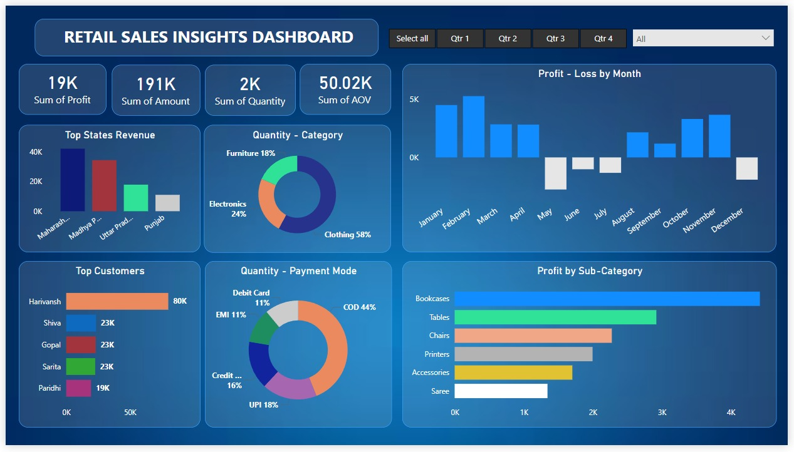

# 🛍️ Retail Sales Insights Dashboard

An interactive Power BI dashboard that visualizes key retail sales metrics and trends for data-driven business decisions.

## 🔧 Tech Stack
- Power BI
- Excel

## 📊 Features
- Dynamic filters and slicers (category, region, date)
- Visual KPIs: Total Sales, Profit, Quantity Sold
- Charts: bar, line, pie, map, and donut
- Drillthrough for product- and region-level analysis

## 🚀 How to Use
1. Download the `.pbix` file from this repository.
2. Open it in **Power BI Desktop**.
3. Use filters to explore insights by category, region, etc.

## 📸 Dashboard Preview

